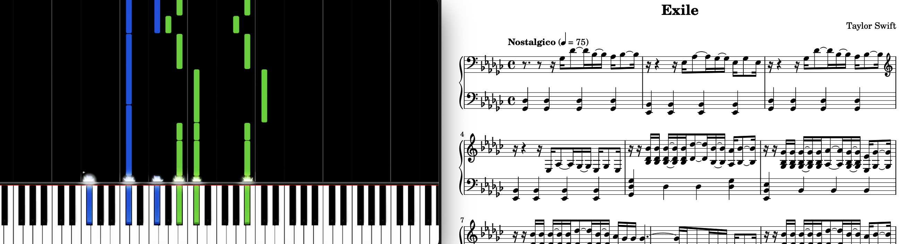

# Video to Piano Sheet Music 🎹



A YouTube video-tutorial is nice, with its notes raining down a polished keyboard (which never misses!), but _sheet music_ is what I wanted the most. If you shared that problem, here is a small hack-and-go python package that tries to do it for you.

## How It Works

The theory is straightforward: pick you favorite piano video-tutorial, parse the color-coded notes, take notice of frame timings and then re-assemble the sheet music leveraging the beautiful `abjad` and `LilyPond` software to craft the actual PDF.

## Usage

The package exposes a main script `parse.py` which parse a input video file and tries to build a piano-sheet music out of it. Here is an example of how it can be used.

```bash
python parse.py video/<path_to_video>.mp4
    --skip_intro 150  # Skip first N frames
    --skip_outro 100  # Skip last N frames
    --early_stop 1500 # Process up-to N frames
    --bpm 75          # Piece Beat-Per-Minute
    --note_color '{"left":"b","right":"g"}' # Dictionary of hand :> color mapping
    --clefs '{"left":{"0":"bass"},"right":{"0":"bass","33":"treble"}}' # Dictionary of hand :> bar_id :> clef
    --rewrite right  # Rewrite meter (nicer formatting)
    --key gf         # Overall Key
    --mood Allegretto         # Mood of piece
    --composer Taylor\ Swift  # Composer
    --title Exile             # Title of the piece
    --out_dir out/            # Output dir
    --out_name <file_name>    # Output file name
    --time_signature 4 4      # Time signature
    --verbose                 # Verbose flag
```

## Requirements

This package builds mainly on top of `open-cv` and `abjad`, to install the required packages simply run

```bash
pip install -r requirements.txt
```
