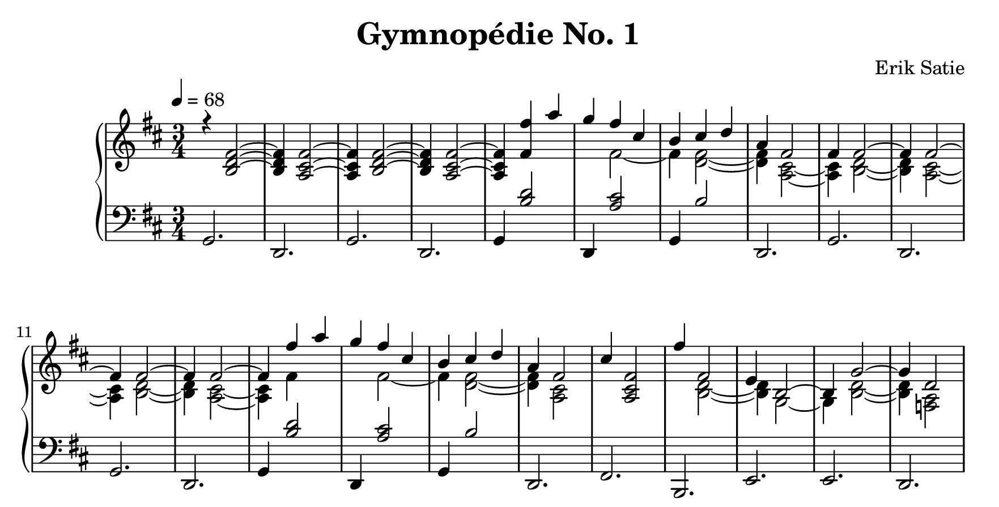
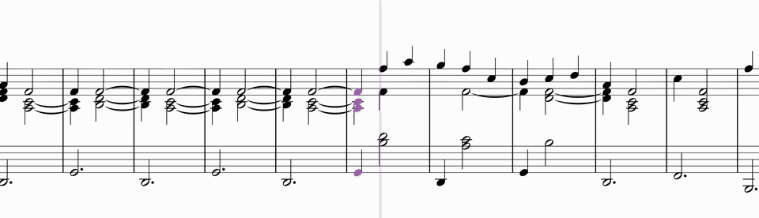
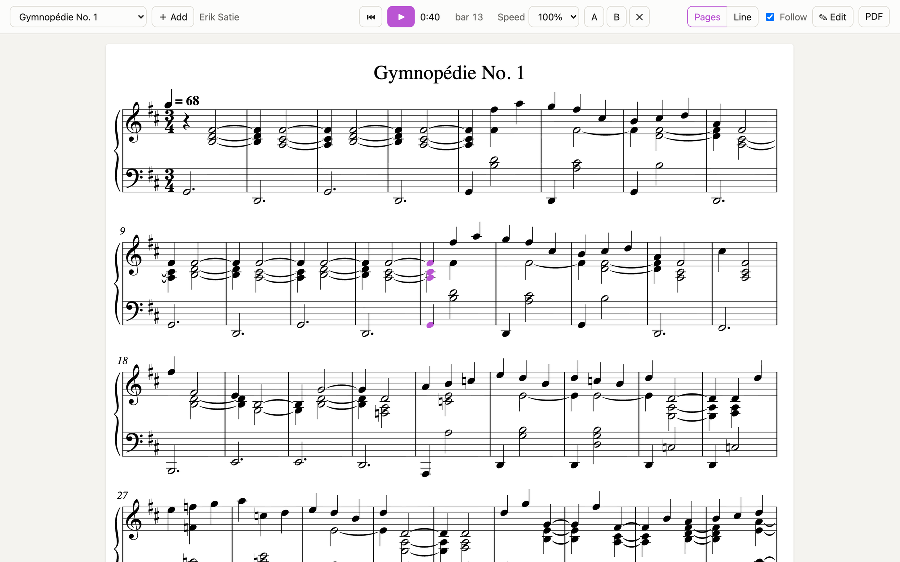
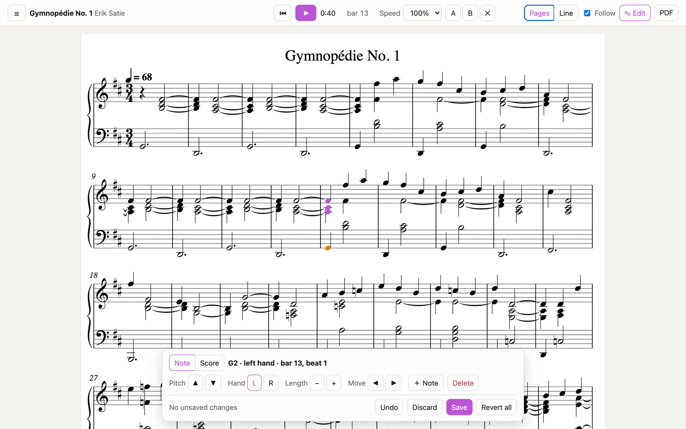
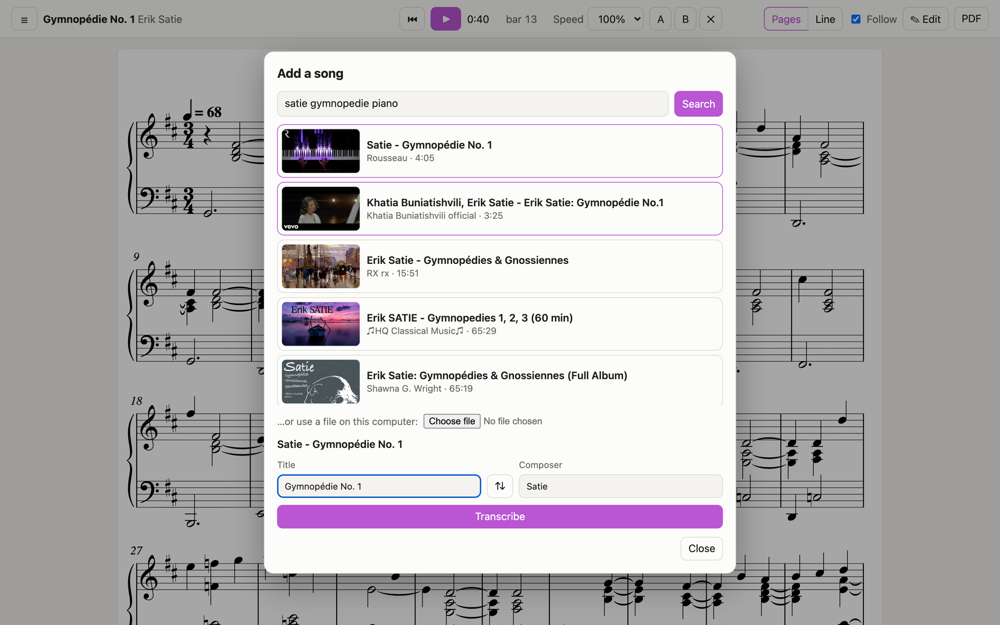
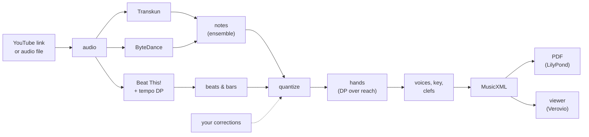
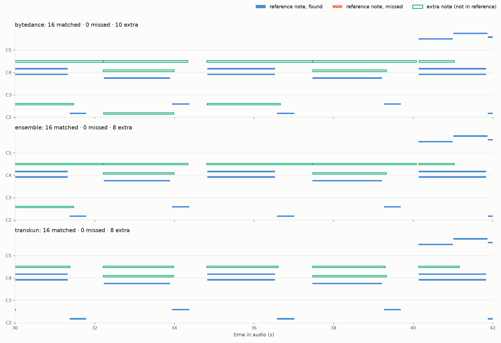

# pianoscribe 🎹

**From a piano recording to sheet music you can practice from.**

Paste a YouTube link, search for a song, or drop in an audio file. pianoscribe listens to the
piano, finds the beat, splits the hands and writes an engraved score (PDF and MusicXML), then
opens it in a practice viewer that follows the original recording note by note.



<p align="center">
  
  <br><em>The practice viewer's line mode: the score streams under a playhead, in sync with the recording.</em>
</p>

## What it does

- **Listens.** Two state-of-the-art piano transcription models, [Transkun](https://github.com/Yujia-Yan/Transkun)
  and [ByteDance's](https://github.com/bytedance/piano_transcription), merged: the note starts of
  one, the note ends of the other.
- **Finds the beat.** [Beat This!](https://github.com/CPJKU/beat_this) activations decoded with
  a tempo-continuity dynamic program; meter (3/4 or 4/4) and downbeats are detected automatically.
- **Writes the score.** Notes snapped to the beat grid, hands decided by a dynamic program over
  where each hand can reach, melody and bass voices where they help, key-aware spelling,
  automatic clef changes, engraved with [LilyPond](https://lilypond.org).
- **Helps you practice.** Notes light up as the recording plays; pages that follow or one
  endless scrolling line; bar loops; slow down without changing pitch; click any note to jump.
- **Makes corrections easy.** Fix a pitch, hand, length or timing right in the viewer, with a
  live preview in well under a second. Or fix the whole score: key, transpose, tempo mark,
  meter, barlines, half/double time. Corrections are kept apart and replayed on every rebuild,
  so they're never lost.
- **Adds songs in one step.** Search YouTube, paste a link or upload a file from the viewer (or
  run `pianoscribe add` in a terminal).

## The practice viewer

| Follows the recording | Correct anything | Add songs |
|---|---|---|
|  |  |  |

Keyboard: <kbd>Space</kbd> play/pause · <kbd>←</kbd>/<kbd>→</kbd> one bar · <kbd>[</kbd>/<kbd>]</kbd>
loop · <kbd>V</kbd> pages/line · <kbd>E</kbd> edit (then <kbd>↑</kbd>/<kbd>↓</kbd> pitch,
<kbd>L</kbd>/<kbd>R</kbd> hand, <kbd>+</kbd>/<kbd>−</kbd> length, <kbd>⌘Z</kbd>, <kbd>⌘S</kbd>).
Run it with `--host 0.0.0.0` and open it on an iPad on the music stand.

## How it works


```mermaid
flowchart LR
    src["YouTube link<br>or audio file"] --> wav["audio"]
    wav --> tk["Transkun"] & bd["ByteDance"]
    tk & bd --> notes["notes<br>(ensemble)"]
    wav --> bt["Beat This!<br>+ tempo DP"] --> grid["beats & bars"]
    notes & grid --> q["quantize"] --> hands["hands<br>(DP over reach)"] --> voices["voices, key,<br>clefs"] --> xml["MusicXML"]
    edits["your corrections"] -.-> q
    xml --> pdf["PDF<br>(LilyPond)"]
    xml --> viewer["viewer<br>(Verovio)"]
```

1. **Audio → notes.** Both models transcribe the recording; the ensemble keeps Transkun's
   onsets (98% precise) and borrows ByteDance's more accurate note ends.
2. **Beats and bars.** The beat tracker is locally precise but can slip onto off-beats or into
   double time; a dynamic program that trades "land on strong activations" against "keep the
   tempo steady" rules those slips out.
3. **Quantization.** Every note start and end is snapped to the grid *independently*, so rounding
   errors can't accumulate and drift the barlines.
4. **Hands.** Audio doesn't say which hand plays what. A dynamic program over both hands'
   positions, with physical limits (an octave's reach, five fingers), decides globally.
5. **Notation.** Voices by musical role (melody over accompaniment, bass under the rest) only
   where they show something one voice can't; gaps become rests only when they're real silences.
6. **Engraving.** MusicXML → LilyPond for the PDF, Verovio for the viewer, which maps every note
   back to the recording's time through the tracked beats (so it follows rubato).

The full story, with every measurement and dead end, is in [DESIGN.md](DESIGN.md).

## How well it works

Measured, not eyeballed. A falling-notes tutorial video is its MIDI drawn as pixels, so
pianoscribe can read the *video* and use it as an answer key for what it heard in the *audio*
(stitching the scrolling picture back together at 1-pixel resolution, finer than the frame rate).

| Song (video style) | Notes found (F1) | Beats / downbeats | Hands |
|---|---|---|---|
| exile (Synthesia tutorial) | **95.7%** | 100% / 100% | 96.1% |
| Never Gonna Give You Up (filmed pianist, PianoX) | **86.2%** | 100% of notes on the grid ± 1/16 beat | n/a |
| Gymnopédie No. 1 (Synthesia tutorial) | **83.2%** | 3/4 detected | staff ≠ playing hand* |

<sub>* Satie writes the chords in the upper staff although the left hand leaps up to play them;
the video colours them by playing hand. Real performances score lower than MIDI renderings,
and each answer key has its own quirks: see DESIGN.md.</sub>



## Quickstart

```bash
brew install uv ffmpeg lilypond              # macOS; any OS with these three works
git clone https://github.com/myscience/video-to-piano.git && cd video-to-piano
uv sync --extra transkun --extra bytedance
uv run pianoscribe download-models           # ~250 MB of model checkpoints
uv run pianoscribe serve                     # open http://localhost:8765 and press "＋ Add"
```

Or from a terminal:

```bash
uv run pianoscribe add "https://www.youtube.com/watch?v=..." --title "..." --composer "..."
# -> library/<song>/<song>.pdf, then `pianoscribe serve` to practice
```

Every step is also its own command (`fetch`, `transcribe`, `merge`, `beats`, `score`, and
`truth` + `eval` for measuring against a tutorial video). Each writes into `library/<song>/`, so
any step can be re-run alone. An Apple-silicon GPU (MPS) or CUDA is used when available.

## Built on

[Transkun](https://github.com/Yujia-Yan/Transkun) ·
[ByteDance piano transcription](https://github.com/bytedance/piano_transcription) ·
[Beat This!](https://github.com/CPJKU/beat_this) ·
[LilyPond](https://lilypond.org) · [Verovio](https://www.verovio.org) ·
[yt-dlp](https://github.com/yt-dlp/yt-dlp) · [mir_eval](https://github.com/mir-evaluation/mir_eval) ·
[FastAPI](https://fastapi.tiangolo.com)

## A note on copyright

pianoscribe is a personal practice tool. Only transcribe recordings you have the right to use,
and don't redistribute transcriptions of copyrighted music. The images in this README use Erik
Satie's *Gymnopédie No. 1* (public domain).
